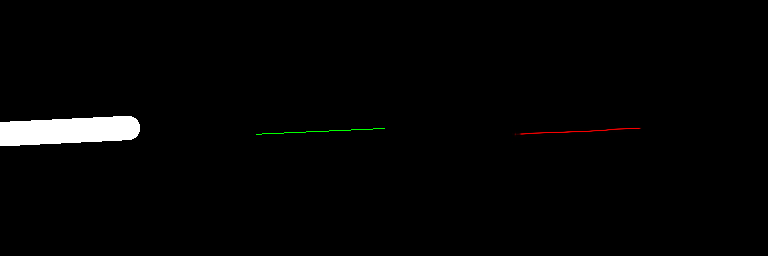
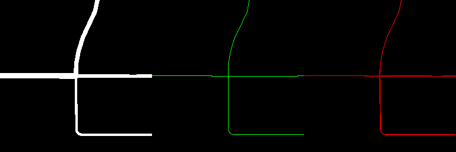
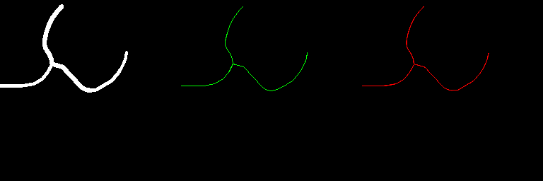
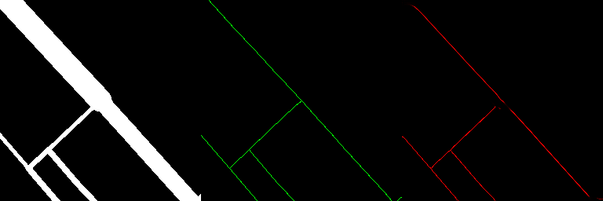

# Road Skeletonization

Predict thin road-centerline skeletons from thick road-network masks using a U-Net,
on data synthesized from real OpenStreetMap road networks.


Given a binary road mask (roads drawn as thick polygons whose width matches their
highway class), the model outputs a probability map that should align with the thin
1-px centerline skeleton of those roads. This is the "mask → centerline skeleton"
segmentation problem.

## How it works

```
OpenStreetMap ──> road network graph (osmnx) ──> crop tiles around intersections
                                                     │
                                                     v
                                        rasterize thick mask + 1px skeleton
                                                     │
                                                     v
                                              (image, target) pairs
                                                     │
                                                     v
                                         U-Net  (mask ─> skeleton)
                                                     │
                                                     v
                                      metrics + side-by-side visualizations
```

### 1. Data generation (`src/make_data.py`)
- Fetches the OSM road network for a place (default: Oxford, Ohio) via `osmnx`.
- Projects it to a local UTM zone and caches edges/nodes as GeoPackages in `cache/`.
- Samples crop centers around road intersections, then for each crop renders:
  - `image_XXXXX.png` — the thick road mask (each road buffered by a random width
    sampled from `DEFAULT_THICKNESS` according to its `highway` tag),
  - `target_XXXXX.png` — the thin 1-px centerline skeleton of the same roads,
  - `target_XXXXX.geojson` — the exact vector linework (for graph-based eval later).
- All tiles are 256×256 at a ground resolution of ~1 m/pixel.

### 2. Dataset (`src/data/dataset.py`)
- `RoadDataset` loads the `image_*`/`target_*` pairs, normalizes to `[0, 1]`,
  and applies a deterministic 80/20 train/val split (seeded).
- Optional random flips for training.

### 3. Model (`src/model.py`)
- A compact U-Net: encoder (conv → max-pool) × 3, bottleneck, decoder with
  bilinear upsampling + skip connections, and a 1×1 conv + sigmoid head.
- ~1.5M params; runs comfortably on CPU and Apple MPS.

### 4. Training (`src/train.py`)
- Loss: `BCE + 0.5 × soft-Dice`.
- Optimizer: Adam (lr 1e-3). Tracks train loss and val loss / Dice / IoU.
- Saves the best checkpoint (by val loss) to `checkpoints/best.pth` and the last
  one to `checkpoints/last.pth`. All hyperparameters live in `configs/baseline.yaml`.

### 5. Evaluation (`src/evaluate.py`)
- Loads a checkpoint and runs the validation split.
- Reports `Dice`, `IoU`, `MSE`, and skeleton-aware precision/recall/F1
  (a prediction pixel counts if it lies within `tol` px of ground truth, and vice
  versa — tolerating the 1–2 px drift of skeleton prediction).
- Writes side-by-side overlays (mask | GT skeleton | predicted skeleton) to `runs/`.

## Results

Trained on 366 samples (Oxford, Ohio) for 50 epochs (~2 min on Apple MPS):

| Metric | Value |
|---|---|
| Val Dice | 0.7535 |
| Val IoU | 0.6060 |
| MSE | 0.0045 |
| Skeleton precision (tol=2) | 0.9999 |
| Skeleton recall (tol=2) | 0.9839 |
| Skeleton F1 (tol=2) | 0.9917 |

Example overlays (left: input mask, middle: ground-truth skeleton, right: prediction):






## Setup

The geospatial stack (osmnx/geopandas/rasterio) is easiest on macOS via conda:

```bash
conda create -n road_skel python=3.13 -c conda-forge
conda install -n road_skel -c conda-forge osmnx geopandas rasterio shapely
conda run -n road_skel pip install -r requirements-train.txt
```

If you only want to train/eval on an existing dataset, `requirements-train.txt`
suffices — the geospatial stack is only needed for data generation.

## Usage

```bash
# 1. Generate the dataset (downloads OSM data on first run)
conda run -n road_skel python -m src.make_data --config oxford-town --n_samples 500

# 2. Train
conda run -n road_skel python -m src.train --config configs/baseline.yaml

# 3. Evaluate the best checkpoint and write visualizations
conda run -n road_skel python -m src.evaluate \
    --config configs/baseline.yaml --ckpt checkpoints/best.pth --out runs/eval_full
```

To quickly check everything works end-to-end, use `configs/smoke.yaml`
(3 epochs) instead of the full 50-epoch config.

## Reproducibility

- Every random process (data sampling, train/val split, flips, model init) is
  seeded from `configs/*.yaml` (`seed: 42`), so runs are reproducible.
- The dataset is derived from a *snapshot* of OSM: the raw edges/nodes GeoPackages
  are cached in `cache/`, so regenerating data does not require the network again.

## Project layout

```
configs/            # YAML hyperparameter configs
src/
  make_data.py      # OSM -> rasterized mask/skeleton pairs
  data/dataset.py   # PyTorch Dataset (image/target + train/val split)
  model.py          # U-Net
  metrics.py        # BCE+Dice loss; Dice/IoU/MSE; skeleton P/R/F1
  train.py          # training loop
  evaluate.py       # validation metrics + overlays
  utils.py          # seed helpers
```

## Requirements

See `requirements-train.txt` (core) and `requirements-data.txt` (data generation).
Tested with Python 3.13, torch 2.10, osmnx 2.1.1, geopandas 1.1.4, rasterio 1.5.1.
