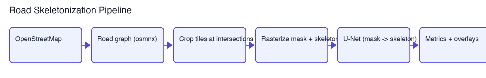
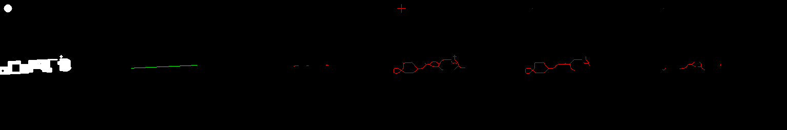
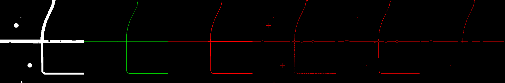
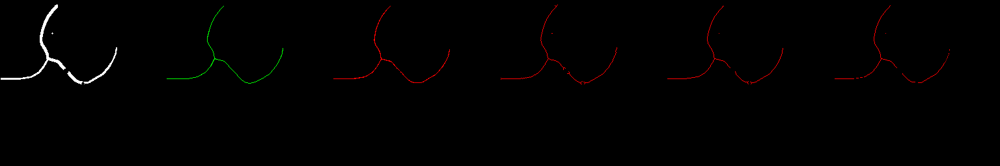
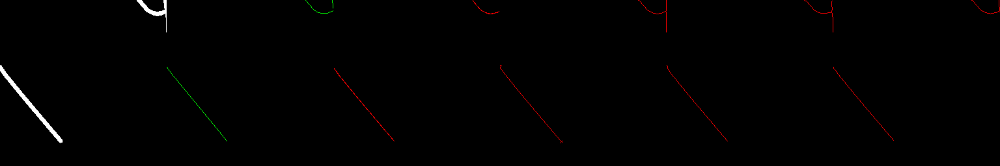
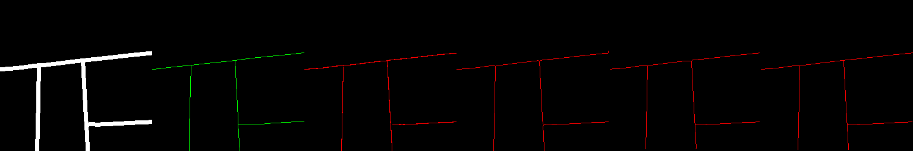
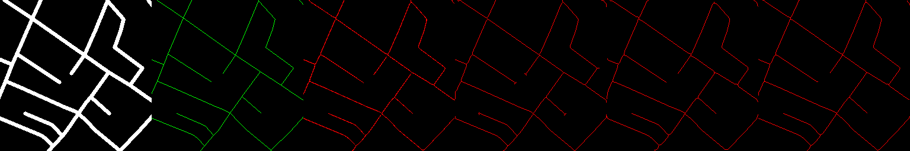

# Road Skeletonization

Recover clean road-centerline skeletons from **imperfect** road masks, validated
against authoritative OpenStreetMap vector data.



## The question this project answers

Road centerlines are the bridge between pixels and routable graphs: thin 1-px
lines that can be re-vectorized into junctions and segments. On a *perfect,
clean* mask this is arguably just geometry — the medial axis (a generalized
"divide by 2") already nails it. **Real masks are not clean.** They come from
segmentation models on satellite imagery or noisy sources, with gaps, ragged
edges, spurious blobs, shadows, and inconsistent widths.

So the real question is:

> **At what level of mask corruption does a learned model beat classical
> skeletonization?**

This project answers it with measurements: we synthesize road masks from real
OSM road networks, corrupt them with a controlled noise model, and benchmark a
trained U-Net against three deterministic baselines across clean→heavy noise.

## How it works

```
OpenStreetMap ──> road graph (osmnx) ──> rasterize thick mask + 1px skeleton
                                                     │
                                     (mask is the input, skeleton is the GT)
                                                     │
                              corrupt input masks on-the-fly (gaps, jitter,
                              spurious blobs, occlusion, width variation)
                                                     │
                          ┌──────────────────────────┴──────────────┐
                          v                                         v
                   U-Net (learned)                medial_axis / skeletonize /
                                                  distance_ridge (classical)
                          └──────────────────────────┬──────────────┘
                                                     v
                              skeleton-aware P/R/F1, Dice, IoU vs. OSM GT
```

### Key design choice: OSM lines as ground truth, corruption as input noise

Both the clean mask *and* the skeleton target are rendered from the same OSM
vector lines (`src/make_data.py`) — the mask is the road line buffered by its
highway width, the skeleton is the raw 1-px centerline. The **input is then
corrupted on-the-fly** (`src/corrupt.py`) while the ground truth stays clean.
This avoids any circularity: the model can never cheat by memorizing the
corruption, because corruption is randomized per sample and only ever touches
the input.

### Corruption model (`src/corrupt.py`)
Five operators simulate realistic detector failures, applied with a tunable
intensity `0.0` (clean) → `1.0` (heavy):

| Operator | Simulates |
|---|---|
| `add_gaps` | broken segments (tree/car/cloud occlusion) |
| `jitter_edges` | imperfect segmentation boundaries |
| `spurious_blobs` | false-positive detections |
| `partial_occlusion` | shadows, buildings |
| `width_variation` | inconsistent detector widths |

Seeded per sample for reproducibility.

### Baselines (`src/baselines.py`)
Classical, deterministic methods that take a mask and return a 1px skeleton:

- **`medial_axis`** — the generalized "divide by 2" (distance-transform ridge).
- **`skeletonize`** — classic morphological thinning, known to spawn spurious
  branches on noisy input.
- **`distance_ridge`** — explicit distance-transform threshold + thin.

## Results

Benchmark on 91 validation tiles, scored against the clean OSM skeleton with a
±2 px skeleton tolerance (`runs/benchmark/results.csv`):

| Noise | Method | Dice | IoU | Skeleton F1 |
|---|---|---|---|---|
| **clean (0.0)** | **U-Net** | **0.744** | **0.597** | **0.991** |
| | medial_axis | 0.687 | 0.529 | 0.981 |
| | skeletonize | 0.653 | 0.494 | 0.987 |
| | distance_ridge | 0.550 | 0.409 | 0.838 |
| **mild (0.3)** | **U-Net** | **0.727** | **0.578** | **0.983** |
| | medial_axis | 0.634 | 0.475 | 0.948 |
| | skeletonize | 0.612 | 0.454 | 0.961 |
| | distance_ridge | 0.502 | 0.364 | 0.787 |
| **moderate (0.6)** | **U-Net** | **0.663** | **0.514** | **0.929** |
| | medial_axis | 0.499 | 0.356 | 0.838 |
| | skeletonize | 0.491 | 0.350 | 0.851 |
| | distance_ridge | 0.381 | 0.267 | 0.635 |
| **heavy (0.9)** | **U-Net** | **0.595** | **0.448** | **0.850** |
| | medial_axis | 0.399 | 0.270 | 0.744 |
| | skeletonize | 0.388 | 0.262 | 0.750 |
| | distance_ridge | 0.284 | 0.188 | 0.514 |

**Reading the table:** on clean masks the classical baselines are nearly
competitive (skeleton F1 0.98–0.99) — confirming the "divide by 2" intuition.
But their advantage collapses under noise: at heavy corruption they drop to
F1 0.51–0.75, while the learned model holds 0.85 and keeps ~10 points of F1
ahead of the best baseline. The U-Net's edge grows monotonically with noise.

Example overlays (heavy noise, columns: corrupted mask | ground-truth skeleton |
U-Net | medial_axis | skeletonize | distance_ridge):





## Real-data validation (Massachusetts Roads)

To check the model generalizes beyond synthetic Oxford tiles, we evaluate it on
the [Massachusetts Roads dataset](http://www.cs.toronto.edu/~vmnih/data/) (Mnih,
2013): 14 real 1500×1500 validation road masks covering dense, irregular road
networks. `src/make_mass_data.py` tiles them into 256×256 patches and rasterizes
the dataset's own vector shapefile centerlines as ground truth (the shapefile is
what the masks were generated from, so GT is independent of our predictions).
This produced 312 patches.

Trained on Oxford, the U-Net is evaluated zero-shot on the real masks, alongside
the same classical baselines:

| Split | Method | Dice | IoU | Skeleton F1 |
|---|---|---|---|---|
| **Mass (real)** | **U-Net** | **0.439** | **0.291** | **0.991** |
| | medial_axis | 0.413 | 0.269 | 0.980 |
| | skeletonize | 0.450 | 0.299 | 0.984 |
| | distance_ridge | 0.442 | 0.297 | 0.977 |

**Reading the table:** the U-Net keeps the highest skeleton F1 (0.991) on a
completely different real road network, and 100% of its predictions land on the
mask. Dice/IoU are far lower than on synthetic data (~0.44 vs ~0.74) because
real dense networks leave little pixel-level slack — a reminder that skeleton
F1 is the meaningful metric here. On these *clean* real masks the classical
baselines stay close, reinforcing the synthetic result: the learned model's edge
is robustness to *noise*, not centerline extraction on clean input.

Example overlays (columns: real mask | GT skeleton | U-Net | medial_axis |
skeletonize | distance_ridge):





## Setup

The geospatial stack (osmnx/geopandas/rasterio) is easiest on macOS via conda:

```bash
conda create -n road_skel python=3.13 -c conda-forge
conda install -n road_skel -c conda-forge osmnx geopandas rasterio shapely
conda run -n road_skel pip install -r requirements-train.txt
```

If you only want to train/eval/benchmark on an existing dataset,
`requirements-train.txt` suffices — the geospatial stack is only needed to
regenerate data.

## Usage

```bash
# 1. Generate the dataset (downloads OSM data on first run)
conda run -n road_skel python -m src.make_data --config oxford-town --n_samples 500

# 2. Train the noise-augmented U-Net (corrupts input masks on-the-fly)
conda run -n road_skel python -m src.train --config configs/baseline.yaml

# 3. Benchmark U-Net vs classical baselines across noise levels
conda run -n road_skel python -m src.benchmark --config configs/benchmark.yaml

# 4. (optional) Benchmark on the real Massachusetts Roads validation set
#    (downloads the dataset + shapefile on first run, then tiles them)
conda run -n road_skel python -m src.make_mass_data
conda run -n road_skel python -m src.benchmark --config configs/benchmark_mass.yaml
```

To quickly check everything works end-to-end, use `configs/smoke.yaml`
(3 epochs) instead of the full 50-epoch config.

## Reproducibility

- Every random process (data sampling, train/val split, flips, corruption
  seeds, model init) is seeded from `configs/*.yaml` (`seed: 42`).
- Corruption is deterministic per sample (md5-derived seed), so benchmarks are
  exactly reproducible.
- The dataset is derived from a *snapshot* of OSM: raw edges/nodes are cached
  in `cache/`, so regenerating data does not require the network again.

## Project layout

```
configs/             # YAML hyperparameter / benchmark configs
src/
  make_data.py       # OSM -> rasterized clean mask/skeleton pairs
  make_mass_data.py  # Massachusetts Roads -> tiled patches + vector GT
  corrupt.py         # noise model for imperfect input masks
  baselines.py       # classical skeletonizers (medial_axis, skeletonize, distance_ridge)
  data/dataset.py    # PyTorch Dataset (mask + on-the-fly corruption + split)
  model.py           # U-Net
  metrics.py         # BCE+Dice loss; Dice/IoU/MSE; skeleton P/R/F1
  train.py           # training loop
  evaluate.py        # single-model validation metrics + overlays
  benchmark.py       # U-Net vs baselines, clean vs noisy, results table
  utils.py           # seed / device helpers
```

## Requirements

See `requirements-train.txt` (core) and `requirements-data.txt` (data
generation). Tested with Python 3.13, torch 2.10, osmnx 2.1.1, geopandas 1.1.4,
rasterio 1.5.1.

## Limitations & future work

- **Masks are real, but inputs are still masks.** The Massachusetts benchmark
  validates generalization to real road networks on *clean* masks. Feeding
  actual satellite/aerial imagery still requires an upstream road-extraction
  model — the natural next step (e.g. train a segmenter on the imagery, then
  run its noisy masks through this skeletonizer).
- **Binary task.** The model thins any blob; distinguishing road vs. driveway
  vs. sidewalk requires multi-class segmentation, out of scope here.
- **Pixels, not graph.** Skeleton output is still pixels; vectorization to a
  routable graph is the downstream step this project feeds into.
